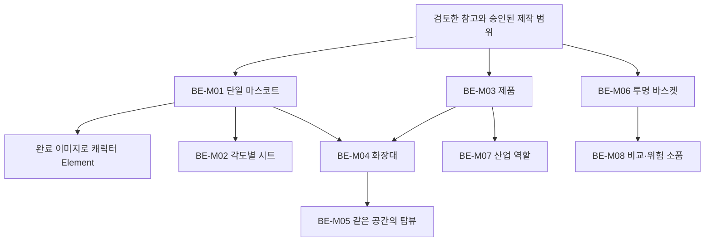

# Higgsfield MCP 기초 에셋 세팅

첫 프로젝트의 기초 에셋은 [설계 문서](research/2026-10-05/17_3D_기초에셋_설계.md)와 [프롬프트 원장](../prompts/beauty-etf/foundation.json)에 연결한다. 수집을 잠시 멈추고 공유용 기획안과 에셋을 먼저 만들라는 최신 지시에 따라 기초 이미지 5종과 Element 4종을 생성했다. [실제 생성 기록](production/beauty-etf-foundation/foundation_assets_manifest.json)에 작업 ID, 원래 프롬프트, 이미지 해시와 파생 관계를 보존한다. 이후 추가 장면 11개를 생성해 초기 S07을 제외하고 10개를 채택했다. 현재 채택 이미지는 기초 5개와 추가 10개를 합친 15개이며, 실제 생성 성공은 16개다. [추가 장면 기록과 금융 근거](production/beauty-etf-expansion/README.md)에 선택·교체 관계를 보존한다. 초기 마스터 ID인 BE-M05·M07·M08을 완료로 바꾸지는 않으며, 영상 생성은 아직 완료하지 않았다.

## 실행 순서

현재 영상에는 [개념 중심 제작 방향](beauty-etf-current-direction.md)을 적용한다. 승인된 이미지 15개의 원본과 미감은 고정하며 재생성하거나 디자인을 변경하지 않는다. 아래 순서는 기존 기초 이미지의 생성·참조 관계를 재사용할 때의 기준이다.

1. 실제 완료 수와 최신 제작 순서를 확인한다. 기초 5종과 추가 채택 10종은 사용자가 지시한 제작 범위이며, 연구 목표 25,000개는 계속 유지한다. 생성 이미지의 연구 신규 참고 수는 0개다.
2. 연결된 계정과 현재 공식 모델의 세로 비율·참조 이미지·Element 지원·비용·작업 상태 반환 방식을 확인한다.
3. BE-M01의 단일 사선 전신 기준 이미지 한 장을 생성한다. 실제 이미지를 열어 큰 크림 얼굴·라벤더 뚜껑 모자·검은 안경·짧은 몸·민트 신발과 손발 분리를 확인한다.
4. 완료된 BE-M01 이미지의 실제 미디어 ID로 캐릭터 Element를 만든다. 생성 중·실패·미확인 ID를 사용하지 않는다.
5. BE-M02는 잠긴 캐릭터에서 각도·표정·손 소품을 파생한다. 같은 얼굴·모자·안경·신발·비례를 유지한다.
6. BE-M03 제품과 BE-M06 바스켓은 독립된 작업으로 묶어 생성할 수 있다. BE-M04 화장대는 BE-M01과 BE-M03이 실제 완료된 뒤 참조해 생성한다. 이번 GPT Image 2.5 파생은 이미지 작업 ID를 직접 참조했으며, 등록된 Element는 해당 참조 방식을 지원하는 모델에서 사용한다. BE-M05 탑뷰는 후속 제작 범위다.
7. 실제 이미지의 용기 수·가구 좌표·빛 방향·반사·내부 토큰·자막 여백을 확인하고 제품·환경의 재사용 Element를 등록한다.
8. 작업별 모델·프롬프트·참조 역할·완료 상태·미디어/Element ID·비율·결과 해시·실제 사용량을 생성 원장에 기록한다.

## 생성 호출과 실패 복구

현재 공식 도구의 스키마를 읽고 독립된 이미지 작업만 배치한다. 의존 이미지와 Element는 앞선 실제 성공 응답에서 받은 ID를 사용한다. 결과가 불명확하면 기존 작업 ID의 상태부터 조회한다. 같은 요청 전체를 중복 실행해 새 비용을 만들지 않는다. 완료 결과를 화면에 표시한 뒤 외형과 구조를 확인한다. 추가 제작의 429 응답 2건은 생성 작업이 접수되지 않은 상태로 분리했고, 재접수 후 완료된 작업 ID만 성공 원장에 기록했다. 초기 S07은 생성 성공 뒤 시각 검수에서 제외했으며 캐릭터를 제거한 S07 v2로 교체했다.

M02의 여러 각도 시트를 첫 캐릭터 Element 입력으로 사용하지 않는다. 재사용 기준은 하나의 선명한 전신이다. 이미지의 입체 미감과 실제 편집 가능한 3D 파일은 구분한다. 별도의 편집 가능한 공간이 필요한 경우 3D Jutsu의 프로젝트·오브젝트·커밋 리비전·렌더를 별도 원장에 기록한다.

## 이미지와 영상의 역할

기초 이미지는 한 세로 구도에 하나의 큰 질문을 읽을 수 있게 한다. 원작 인물과 의상을 그대로 복제하지 않고 제품형 독자 마스코트를 사용한다. 현재 영상의 생성 이미지와 후편집 자막 모두에서 특정 기업명·ETF 상품명과 실제·가상의 숫자 비중을 제외한다. 사업 역할과 ETF 바구니의 개념, 검증된 시장 CAGR·기간·출처를 자막으로 설명하며 산업 성장률을 ETF 수익률로 표시하지 않는다.

이후 I2V는 잠긴 마스터의 한 동작을 만든다. 속도감은 짧은 이동, 제품 근접→공간 전체의 스케일 교대, 형태가 이어지는 컷으로 구성한다. 데이터를 읽는 순간의 카메라는 안정시킨다.
